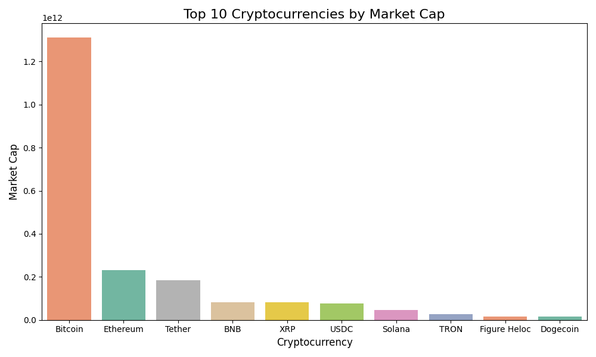
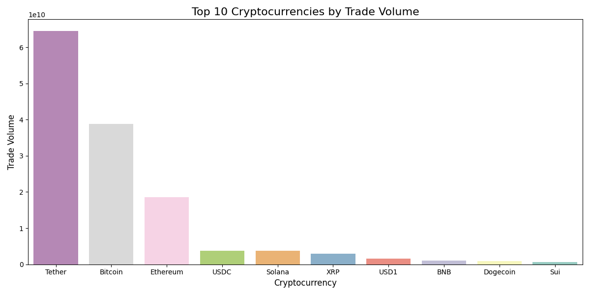
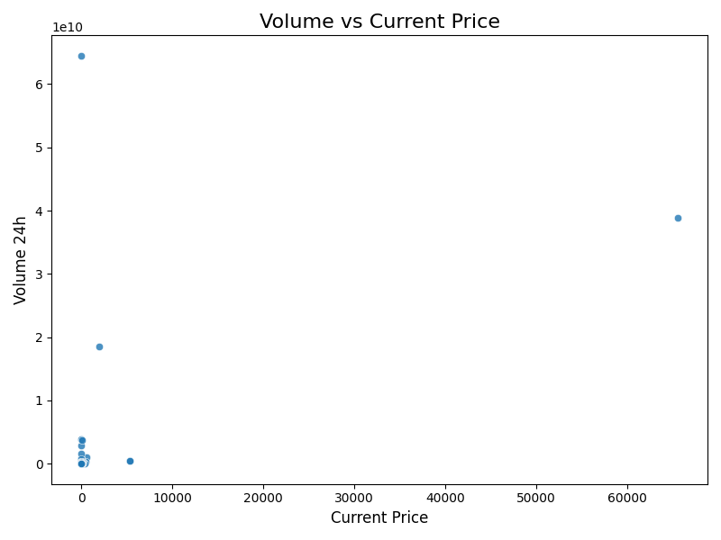
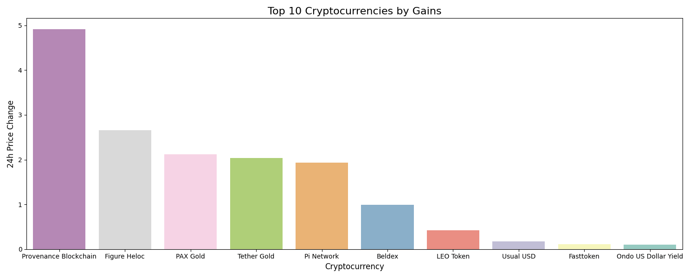
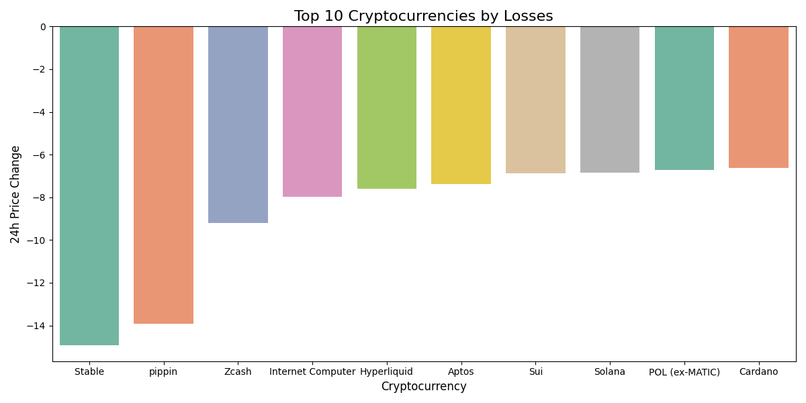

# Crypto Market Analysis Report

## Overview

This report analyzes cryptocurrency market data from the CoinGecko API, covering the top 100 cryptocurrencies by market capitalization.

### Note

More visual and analysis are available at [Crypto Market Analysis Streamlit Dashboard](https://bensxnisaac-crypto-market-analysis-dashboardsapp-25wirn.streamlit.app/)

## Key Findings

### Market Summary

- **Total Market Cap**: $2,282,274,689,174
- **Average 24h Price Change**: Negative (bearish market trend)
- **Most Traded Coin**: Tether (USDT) with ~$64.5B in 24h volume

### Market Leaders

1. **Bitcoin (BTC)**: $1.31T market cap - 57% market dominance
2. **Ethereum (ETH)**: $231.7B market cap
3. **Tether (USDT)**: $183.6B market cap

### Price Distribution

- **Median Price**: $1.00
- **Mean Price**: $806.27
- **Price Range**: $0.00 - $65,572.00
- 75% of cryptocurrencies are priced at $4.52 or below, indicating a market dominated by low-priced altcoins

### Liquidity Analysis

Volume-to-Market-Cap ratios reveal trading activity:

- **Tether**: 0.35 (35% daily turnover - highest liquidity)
- **Ethereum**: 0.08 (8% turnover)
- **Bitcoin**: 0.03 (3% turnover)
- **BNB**: 0.01 (1% turnover)

Higher ratios indicate easier buying/selling without price impact. Stablecoins like Tether show highest liquidity due to their use as trading pairs.

### Correlations

- **Price vs Market Cap**: 0.97 (very strong) - Higher-priced coins have larger market caps
- **Market Cap vs Volume**: 0.63 (moderate) - Larger coins tend to have more volume
- **Price vs Volume**: 0.49 (moderate) - Price alone doesn't determine trading activity

### Market Sentiment

All top cryptocurrencies showed negative 24h price changes, indicating a bearish market period:

- Bitcoin: -3.17%
- Ethereum: -5.98%
- BNB: -3.23%
- XRP: -4.31%

## Conclusion

The cryptocurrency market is dominated by Bitcoin (57% market share) with most coins being low-priced altcoins. Tether leads in trading volume due to its role as a stablecoin trading pair. The market showed bearish sentiment during the analysis period with negative price movements across major cryptocurrencies.
